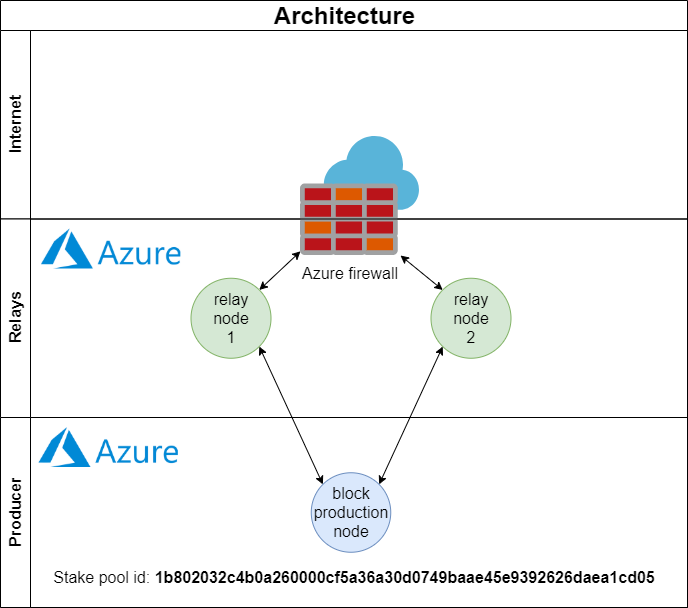

## Welcome to cardanolab.at

This is the webpage of cardanolab.at.

Cardanolab runs a haskell stake pool for the MAINNET.

The stake pool is hosted on Microsoft Azure to ensure a high reliability and availibility. The stake pool is running on a Virtual Machine (VM) with 2 CPUs and 8 GB RAM with Premium SSD. A state-of-the-art firewall protects the stake pool from being attacked.

Detailed information about the stake pool is available on [Pooltool.io](https://pooltool.io/pool/1b802032c4b0a260000cf5a36a30d0749baae45e9392626daea1cd05/blocks).

### Support or Contact

Cardanolab team: mail@cardanolab.at

[Impressum](https://cardanolab.at/impressum.html)
