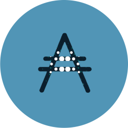

## Welcome to cardanolab.at

This is the webpage of cardanolab.at.

Cardanolab runs a Cardano stake pool built with love in Austria.

The relay is hosted on Microsoft Azure to ensure a high reliability and availibility. The block producer is running on a dedicated server located in Austria. A state-of-the-art firewall protects the stake pool from being attacked.

## Costs

We are starting the service with 0% relative fee until 01.01.2021. Then we will adust the factor between 0% - 2% to have a resonable fee. We guarantee that the relative fee will NEVER exceed 2%.

## Relay node status

The current status and the uptime of the relay node can be checked online: [relay node online status](https://status.cardanolab.at/)

## Cardano stake pool info

<iframe width="500" height="400" frameborder="0" src="https://js.adapools.org/widget.html?pool=9a5a68a5b99a0b885422d7111fef41be2ac312933ad9db9cf0926239"><a href="https://adapools.org/pool/9a5a68a5b99a0b885422d7111fef41be2ac312933ad9db9cf0926239">Detail</a></iframe>

## Contact

Mail: [mail@cardanolab.at](mailto:mail@cardanolab.at)  
Twitter: [cardanolab](https://twitter.com/cardanolab)  
Telegram channel: [cardanolab](https://t.me/cardanolab)  
Discord server: [discord](https://discord.gg/VXPGEem)

## Legal
[Impressum / Imprint](https://cardanolab.at/impressum.html)
